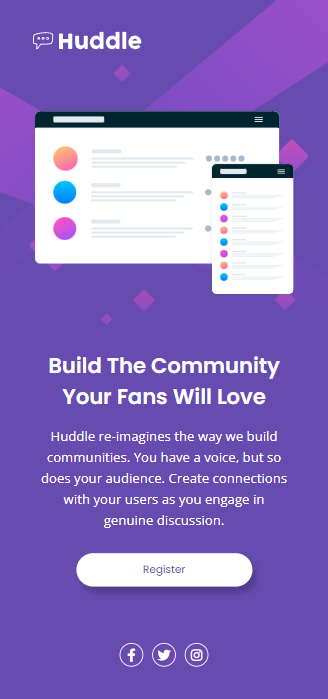

# Challenge huddle landing page with single introductory section master

Quest (desafio) proposta pelo curso [DevQuest](https://devemdobro.com) com o foco de resolver o [desafio do Frontend Mentor](https://www.frontendmentor.io/solutions/landing-page-using-display-flex-m6yHxPouoe) de criar uma cópia tanto da versão **desktop (1440px x 800)** quanto **mobile (375px x 800px)** da seguinte Landing Page responsiva:


 
**Estados ativos:**


## Minha resolução
<div>
    
    
</div>

[Clique aqui](https://amandameneghini.github.io/huddle-landing-page-with-single-introductory-section-master/) para visualizar

### Tecnologias Utilizadas

<div>
    
    
</div>

### Ferramenta Utilizada


<br>

**Extenção** do Google Chrome "Pixel Perfect" 

## Como utiliza

1. Crie uma pasta em que deseja clonar o repositório.

2. Com o botão dirteito do mouse selecione a opção "Git Bash HERE"

3. Clone o projeto (no Git Bash):

```
git clone https://github.com/AmandaMeneghini/huddle-landing-page-with-single-introductory-section-master.git
```

4. Acesse a pasta do projeto:

```
cd huddle-landing-page-with-single-introductory-section-master
```

5. Abra o código no VS Code:

```
code .
```

Passos extras com o **Live Server** no **VS Code**:

6. Vá no VS Code em extenções e baixe a extenção "Live Server"

7. Aperte **Alt + L + O**, para a visualização do projeto